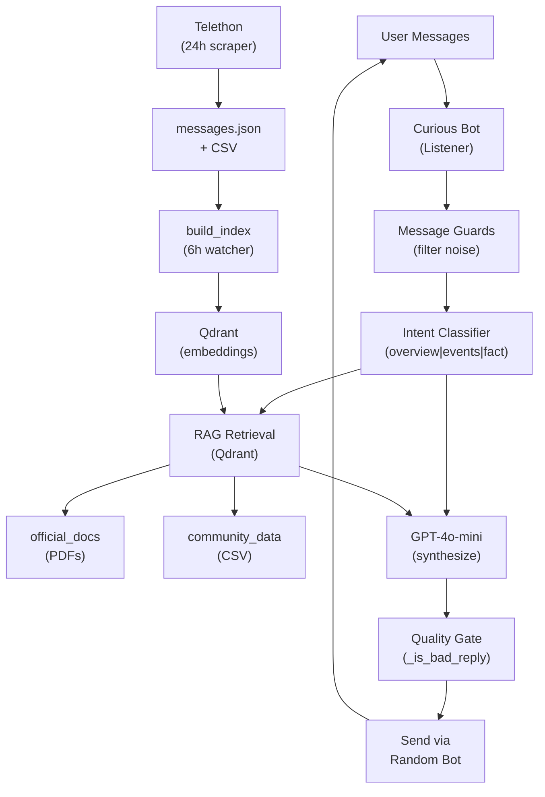

# Multi Agent Bot

A **RAG-powered Telegram assistant** for groups. Four AI personas answer member questions using official docs, admin announcements, and community history.

## Quick Overview

| Aspect | Details |
|--------|---------|
| **What it does** | Listens for group questions → retrieves relevant docs/admin posts from Qdrant → uses GPT-4o-mini to synthesize answers with consistent personas |
| **Knowledge sources** | PDFs, admin history (CSV), live message log, OCR from photos |
| **Bots** | Helper, Curious (listener), Tech, Skeptic — random selection per reply |
| **Entry point** | `main.py` (~1,400 lines, single process, background threads) |
| **Architecture** | Telegram → Message guards → Intent classification → RAG retrieval → LLM synthesis → Quality gate → Send via bot |

---

## Architecture



---
## What This Project Does

| Capability | Description |
|------------|-------------|
| **Q&A in Telegram group** | Listens for real questions (keywords / `?`) and replies with RAG-backed answers |
| **Four distinct personas** | Helper, Curious, Tech, Skeptic — each with different tone, randomly chosen per reply |
| **Knowledge from multiple sources** | PDFs, admin CSV history, live message log, OCR from photos |
| **Live price lookup** | DEOD price via CoinMarketCap when users ask about price/value |
| **Admin announcement reactions** | Bots briefly react to big admin posts (airdrops, listings, campaigns) |
| **Idle engagement** | When the group is quiet, bots share facts, ask questions, or post openers |
| **Self-updating knowledge** | Background jobs re-fetch admin history and rebuild the vector index |

**Single entry point:** `main.py` (~1,400 lines). No separate API server — everything runs in one Python process with background threads.

---


## Core Components

### Listener (Curious Bot)
- Only bot that **receives** group messages
- All 4 bots **send** replies (randomly selected)
- Handles text and photo content

### Reply Engine
1. Classify intent: `overview` | `events` | `fact`
2. Expand search query
3. Retrieve top-k chunks from Qdrant (official + community)
4. Build persona + context prompt
5. GPT-4o-mini synthesizes answer
6. Quality gate: reject if too short → retry or fallback
7. Send via random bot

### Vector Store (Qdrant)
- **Embeddings:** OpenAI `text-embedding-ada-002` (1536 dim, cosine similarity)
- **Collections:**
  - `official_docs` — Chunked PDFs/TXT (1000 chars, 150 overlap)
  - `community_data` — Filtered CSV rows with authority boosts

### Ranking Boosts
```
score = vector_distance + authority_boost + recency_boost + doc_type_boost
```
Authority: Official docs > Announcements > Admin > Community

### History Scraper (Telethon)
- Fetches last 24h of admin messages every **24 hours**
- Updates `messages.json` + CSV files
- Triggers full RAG rebuild after sync

### Live Logging
- All Q&A appended to `pdfs/live_updates.csv`
- Used for audit and re-indexing

---

## Message Filtering

Questions are processed if they:
- Contain `?` OR a keyword (`deod`, `staking`, `airdrop`, etc.)
- Are longer than 5 characters
- Come from group members (not bots)

**Ignored:** Bot messages, photos-only, very short greetings, private DMs

**Special handling:**
- Admin announcements: optional bot reaction (8–20s delay)
- Photos: OCR to CSV, no immediate reply
- Idle group (67+ min silent): auto-share facts or ask questions

---

## The Four Bots

| Bot | Token Env | Personality |
|-----|-----------|-------------|
| Helper | `BOT_HELPER_TOKEN` | Warm, direct, clear |
| Curious | `BOT_CURIOUS_TOKEN` | Thoughtful, engaged *(also listener)* |
| Tech | `BOT_TECH_TOKEN` | Precise, contract-focused |
| Skeptic | `BOT_SKEPTIC_TOKEN` | Analytical, balanced |

Each reply randomly picks one. All use same RAG context — persona only affects **tone**, not **facts**.

**Answer length by intent:**
- `overview`: 2–4 sentences
- `events`: 2–3 sentences + dates
- `fact`: 1–2 sentences

---

## Background Workers

| Thread | Interval | Task |
|--------|----------|------|
| **History scraper** | 24h | Fetch admin messages → update CSV → rebuild index |
| **Index watcher** | 6h | Rebuild Qdrant if CSV files changed |
| **Auto topics** | 50–115 min | Post idle content if group silent for 67+ min |

---

## Project Structure

```
multi__bot1/
├── main.py                          # Entire app (config, RAG, bots, CLI)
├── requirements.txt                 # Dependencies
├── .env                             # Secrets (never commit)
├── bot_session.session              # Telethon session
│
├── pdfs/                            # Knowledge sources
│   ├── *.pdf, *.txt                 # Official docs → indexed
│   ├── *.csv                        # Admin history
│   ├── live_updates.csv             # Real-time Q&A log
│   └── photo_hashes.json            # OCR dedup cache
│
├── qdrant_storage/                  # Vector DB (local)
└── venv_bot/                        # Virtual environment
```

---

## Configuration

Create `.env` in project root:

```env
# ── Required ──
OPENAI_API_KEY=sk-...
GROUP_CHAT_ID=-100xxxxxxxxxx

BOT_HELPER_TOKEN=...
BOT_CURIOUS_TOKEN=...
BOT_TECH_TOKEN=...
BOT_SKEPTIC_TOKEN=...

# ── Qdrant ──
QDRANT_URL=http://localhost:6333

# ── Telethon ──
TELEGRAM_API_ID=...
TELEGRAM_API_HASH=...

# ── Optional ──
COINMARKETCAP_API_KEY=...
ENABLE_AUTO_TOPICS=true
```

### Setup Steps

1. Create **4 bots** via [@BotFather](https://t.me/BotFather)
2. Add all 4  group (disable privacy mode)
3. Get `GROUP_CHAT_ID` (negative number)
4. Run Telethon once to create `bot_session.session`
5. Edit `ADMINS` dict in `main.py` with your admin usernames/IDs

---

## Setup & Run

### Prerequisites
- Python 3.10+
- Qdrant (Docker or local)
- OpenAI + Telegram + Telethon credentials

### Installation

```powershell
python -m venv venv_bot
.\venv_bot\Scripts\Activate.ps1
pip install -r requirements.txt
```

### Start Qdrant

```powershell
docker run -p 6333:6333 -v "%cd%\qdrant_storage:/qdrant/storage" qdrant/qdrant
```

### Run Bot

```powershell
# Clean old bot rows + rebuild index (recommended first run)
python main.py --clean-csv

# Start bot (auto-builds index if needed)
python main.py
```

---

## CLI Commands

| Command | Action |
|---------|--------|
| `python main.py` | Start bot (auto-build index if needed) |
| `python main.py --build` | Force full index rebuild |
| `python main.py --clean-csv` | Remove bot rows from CSVs + rebuild |

---

## Data Sources

| Source | Indexed as | Filter rules |
|--------|-----------|--------------|
| `pdfs/*.pdf, *.txt` | `official_docs` | Chunk: 1000 chars, overlap: 150 |
| `pdfs/*.csv` | `community_data` | Length > 10 chars, relevance keywords or admin |
| `live_updates.csv` | Both | Q&A log (no bot rows indexed) |

**Authority boost:** Official docs > Announcements > Admin > Community

**Critical:** Bot replies never indexed (prevents "idk tbh" filling the database)

---

## Troubleshooting

| Issue | Cause | Fix |
|-------|-------|-----|
| One-word answers | Old code or bad quality gate | Ensure latest `main.py` |
| Always "idk tbh" | Qdrant empty/unreachable | Check `QDRANT_URL`, run `--build` |
| Bot never replies | Privacy mode on / missing `?` | Disable privacy, use keywords |
| Stale event info | Index outdated | Run `--build` |
| History not updating | Telethon session missing | Run Telethon login interactively |
| Bot answers in database | CSV pollution | Run `python main.py --clean-csv` |
| Price lookup fails | No CMC key | Set `COINMARKETCAP_API_KEY` |

**Verify Qdrant:**
```powershell
curl http://localhost:6333/collections
```

---

## Tech Stack

| Layer | Technology |
|-------|------------|
| Language | Python 3.10+ |
| Telegram | [pyTelegramBotAPI](https://github.com/eternnoir/pyTelegramBotAPI) (send/listen) |
| History scraper | [Telethon](https://github.com/LonamiWebs/Telethon) |
| LLM | OpenAI GPT-4o-mini |
| Embeddings | OpenAI `text-embedding-ada-002` |
| Vector DB | [Qdrant](https://qdrant.tech/) |
| Document parsing | LangChain (PyPDF, TextLoader, RecursiveCharacterTextSplitter) |
| OCR | GPT-4o-mini vision |
| Price data | CoinMarketCap Pro API |
| Config | python-dotenv |

---

## Summary

Members ask → **Curious bot** listens → Message guards filter → Intent classification → **Qdrant** retrieval (official + community) → **GPT-4o-mini** synthesis → Quality gate → Send via random bot persona. In parallel: **Telethon** scrapes admin history, **live_updates.csv** logs interactions, **background threads** rebuild index every 6h.

---

## Important Notes

- Keep `.env` and `bot_session.session` **private** — never commit to git
- For production: use `systemd`, PM2, or similar for auto-restart
- Monitor API costs (OpenAI, CoinMarketCap)

 CONTACT ME FOR ANY HELP - sushantmanitripathiji@gmail.com
