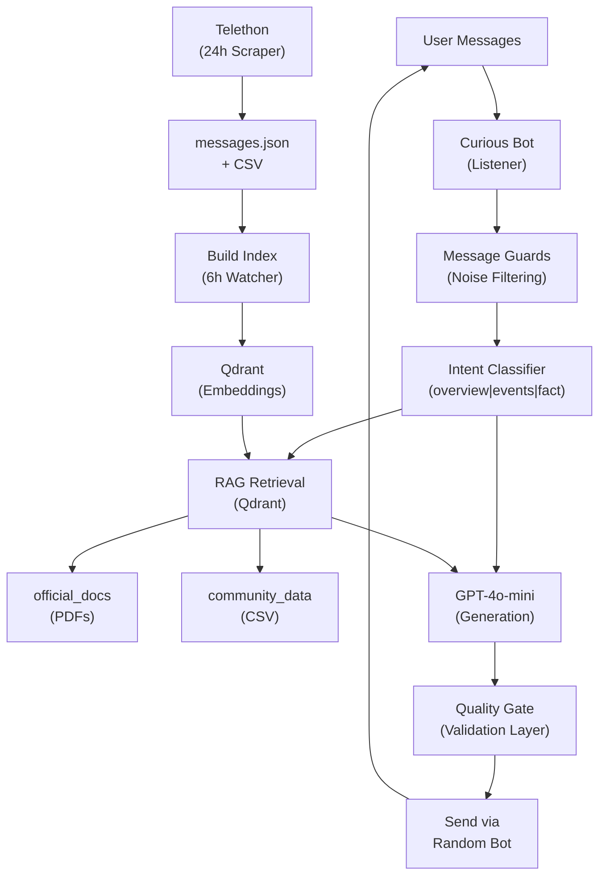

# Multi Agent Enterprise System

<div align="center">

### Tech Stack


</div>

---

A **RAG-powered Telegram assistant ecosystem** for communities and enterprise groups. Four AI personas answer user questions using official documentation, admin announcements, community history, and continuously updated knowledge retrieval.

---

## Quick Overview

| Aspect | Details |
|----------|----------|
| **What it does** | Detects user questions → retrieves relevant documents/admin history from Qdrant → synthesizes contextual replies using GPT-4o-mini |
| **Knowledge sources** | PDFs, admin announcements (CSV), live message logs, OCR extracted image content |
| **Bots** | Helper, Curious (listener), Tech, Skeptic |
| **Entry point** | `main.py` (~1400 lines, single process architecture) |
| **Architecture** | Telegram → Guards → Intent Classification → RAG Retrieval → LLM Generation → Quality Validation → Bot Response |

---

## Architecture



---

## What This Project Does

| Capability | Description |
|------------|-------------|
| **Telegram Q&A Assistant** | Detects valid user questions and responds with retrieval-backed answers |
| **Multi-Agent Personas** | Helper, Curious, Tech, Skeptic with different communication styles |
| **Multi-source Knowledge** | PDFs, community history, admin data, OCR extracted image text |
| **Live Price Lookup** | Fetches token/coin prices using CoinMarketCap API |
| **Admin Event Reactions** | Bots automatically react to major admin announcements |
| **Idle Engagement Engine** | Generates autonomous engagement when community is inactive |
| **Continuous Knowledge Updates** | Background workers rebuild vector database automatically |

**Architecture:** Single-process Python application with concurrent background workers.

---

## Core Components

### Listener Agent (Curious Bot)

- Sole message receiver
- Handles incoming text + photo messages
- Routes valid messages into processing pipeline

---

### Reply Engine Pipeline

1. Intent Classification → `overview | events | fact`
2. Query Expansion  
3. Retrieve top-k vectors from Qdrant  
4. Build persona + contextual prompt  
5. Generate answer via GPT-4o-mini  
6. Validate answer quality  
7. Send through randomly selected bot persona  

---

### Vector Database (Qdrant)

**Embeddings**

- OpenAI `text-embedding-ada-002`
- 1536 dimensions
- Cosine similarity search

**Collections**

- `official_docs` → PDFs/TXT chunks  
- `community_data` → CSV/admin/community history  

---

### Ranking Logic

```text
score = vector_distance + authority_boost + recency_boost + doc_type_boost
```

Priority hierarchy:

```text
Official Docs > Announcements > Admin > Community
```

---

### History Scraper (Telethon)

- Fetches previous 24h admin messages
- Runs every 24 hours
- Updates CSV + messages.json
- Triggers vector rebuild after synchronization

---

### Live Logging

Stores all conversations in:

```text
pdfs/live_updates.csv
```

Used for:

- Re-indexing
- Audit trail
- Historical retrieval

---

## Message Filtering Rules

Questions processed only if:

- Contains `?`
- Contains trigger keywords (`deod`, `staking`, `airdrop`, etc.)
- Message > 5 characters
- Message from actual group member

Ignored:

- Bot messages  
- Private DMs  
- Photos only  
- Short greetings  

Special handling:

- Admin announcements → delayed reactions (8–20 sec)
- Photos → OCR extraction only
- Silent group (67+ min) → autonomous engagement

---

## AI Agents

| Agent | Environment Variable | Behavior |
|---------|---------|---------|
| Helper | `BOT_HELPER_TOKEN` | Clear, warm communication |
| Curious | `BOT_CURIOUS_TOKEN` | Engaged, conversational *(listener)* |
| Tech | `BOT_TECH_TOKEN` | Technical, precise |
| Skeptic | `BOT_SKEPTIC_TOKEN` | Analytical, balanced |

All bots use same retrieval context. Difference exists only in response style.

---

## Background Workers

| Worker | Interval | Function |
|----------|----------|----------|
| History Scraper | 24h | Fetch admin messages + rebuild knowledge |
| Index Watcher | 6h | Detect changes and rebuild vector index |
| Auto Topics | 50–115 min | Generate engagement when group inactive |

---

## Project Structure

```bash
multi_bot/

├── main.py
├── requirements.txt
├── .env
├── bot_session.session

├── pdfs/
│   ├── *.pdf
│   ├── *.txt
│   ├── *.csv
│   ├── live_updates.csv
│   └── photo_hashes.json

├── qdrant_storage/
└── venv_bot/
```

---

## Configuration

Create `.env`

```env
OPENAI_API_KEY=sk-...

GROUP_CHAT_ID=-100xxxxxxxxxx

BOT_HELPER_TOKEN=...
BOT_CURIOUS_TOKEN=...
BOT_TECH_TOKEN=...
BOT_SKEPTIC_TOKEN=...

QDRANT_URL=http://localhost:6333

TELEGRAM_API_ID=...
TELEGRAM_API_HASH=...

COINMARKETCAP_API_KEY=...

ENABLE_AUTO_TOPICS=true
```

---

## Setup

### Requirements

- Python 3.10+
- Docker
- Qdrant
- Telegram API credentials
- OpenAI API key

---

### Installation

```powershell
python -m venv venv_bot
.\venv_bot\Scripts\Activate.ps1
pip install -r requirements.txt
```

---

### Run Qdrant

```powershell
docker run -p 6333:6333 -v "%cd%\qdrant_storage:/qdrant/storage" qdrant/qdrant
```

---

### Start Application

```powershell
python main.py --clean-csv

python main.py
```

---

## CLI Commands

| Command | Action |
|----------|----------|
| `python main.py` | Start application |
| `python main.py --build` | Force rebuild vector index |
| `python main.py --clean-csv` | Remove bot rows and rebuild |

---

## Data Sources

| Source | Indexed As | Rules |
|----------|----------|----------|
| PDFs/TXT | official_docs | Chunk size 1000, overlap 150 |
| CSV Files | community_data | Relevance filtering |
| live_updates.csv | Both | Stores live Q&A logs |

Important:

```text
Bot generated responses are never indexed.
```

Prevents low-quality responses contaminating retrieval database.

---

## Troubleshooting

| Issue | Cause | Fix |
|----------|----------|----------|
| Short replies | Validation issue | Update latest main.py |
| “idk tbh” responses | Empty vector DB | Run `--build` |
| Bot inactive | Privacy mode enabled | Disable privacy |
| Stale answers | Old embeddings | Rebuild index |
| No history sync | Telethon missing | Login manually |
| Price lookup fails | Missing API key | Add CoinMarketCap key |

---

## Full Tech Stack

| Layer | Technology |
|----------|----------|
| Language | Python 3.10+ |
| LLM | OpenAI GPT-4o-mini |
| Embeddings | OpenAI text-embedding-ada-002 |
| Vector Database | Qdrant |
| Telegram Framework | pyTelegramBotAPI |
| History Scraper | Telethon |
| Retrieval Pipeline | LangChain |
| OCR | GPT-4o-mini Vision |
| Price API | CoinMarketCap |
| Config | python-dotenv |
| Deployment | Docker |

---

## System Flow

```text
User Message
      ↓
Curious Bot Listener
      ↓
Message Validation Layer
      ↓
Intent Classification
      ↓
Vector Retrieval (Qdrant)
      ↓
Context Construction
      ↓
GPT-4o-mini Generation
      ↓
Quality Validation
      ↓
Random Agent Response
```

Background processes:

```text
Telethon → History Sync → CSV Update → Rebuild Embeddings → Qdrant Update
```

---

## Security Notes

- Never commit `.env`
- Never expose `bot_session.session`
- Use process managers (`systemd`, PM2) for production deployment
- Monitor OpenAI API usage and cost

---

## Contact

**Sushant Mani Tripathi**  
📧 sushantmanitripathiji@gmail.com
